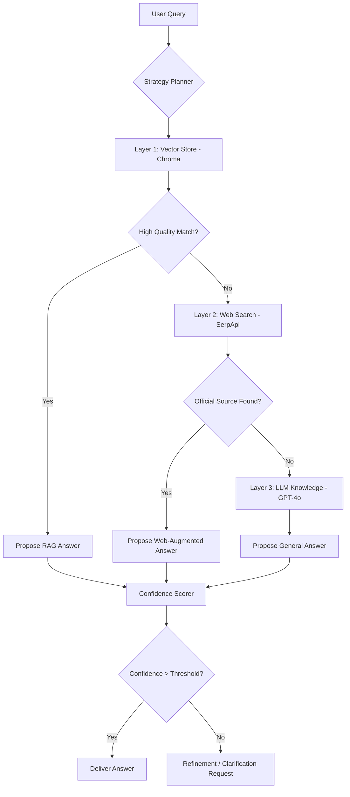

# Production-Grade Fallback Architecture

This document outlines the multi-layer fallback strategy for the SageAlpha Financial RAG system. The goal is to ensure high reliability and accuracy by gracefully transitioning between different data sources based on availability and confidence.

## Architecture Overview

The system uses a "Swiss Cheese" model where each layer catches queries that the layer above could not answer satisfactorily.

## Layers of Fallback

### 1. Vector Store (Chroma DB)
- **Primary Source**: Contains curated, high-fidelity corporate filings (10-K, 10-Q, Annual Reports).
- **Trigger**: Default for all financial queries.
- **Success Criteria**: Retrieval similarity > 0.7 AND Metadata match for User's target company/year.

### 2. Soft-Fail Web Search
- **Secondary Source**: Searches Google/SerpApi specifically for official investor relations domains.
- **Trigger**: Chroma returns zero results OR confidence score < 0.4.
- **Constraint**: Only includes results from `PRIORITY_WEB_DOMAINS` (e.g., .gov, company official sites).

### 3. LLM Internal Knowledge
- **Last Resort**: Uses the LLM's pre-trained weights.
- **Trigger**: Both Chroma and Web Search fail.
- **Policy**: Always accompanied by a "Training Data Disclosure" warning.

## Guardrail Integration

| Guardrail | Purpose | Implementation |
|-----------|---------|----------------|
| **Numeric Validator** | Prevents hallucinations of figures | Regex extraction + Cross-source verification |
| **Entity Lock** | Ensures data belongs to the correct company | Metadata filtering in Chroma |
| **Confidence Scoring** | Aggregates signals into a 0-1 score | Weighted average of similarity + source reliability |

## Error Recovery
If high-level failures occur (e.g., Chroma connection timeout), the system automatically triggers an **Auto-Recreation Logic** or a graceful degradation to Web-Only mode.
